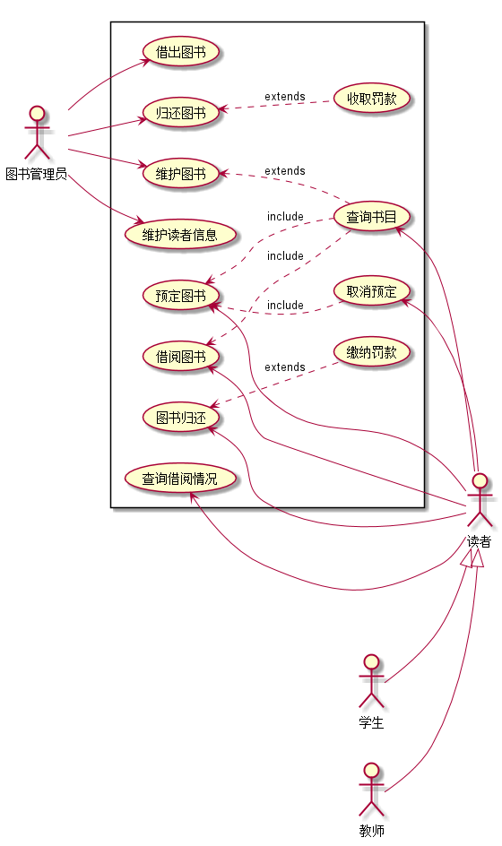
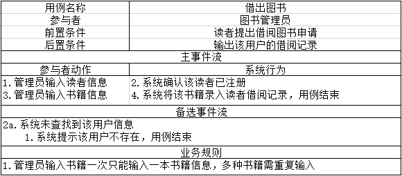
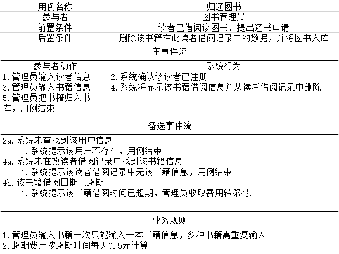
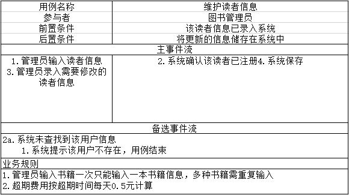
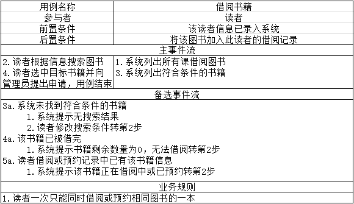
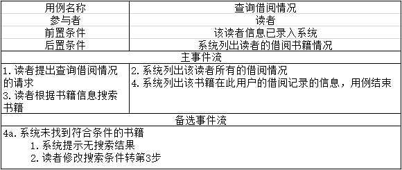
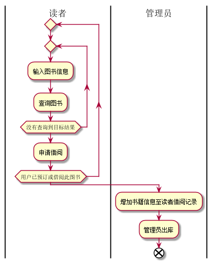
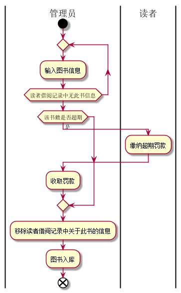

# 实验2：图书管理系统用例建模

|学号|班级|姓名|照片|
|:-------:|:-------------: | :----------:|:---:|
|201510414420|软件(本)15-4|吴靖||

## 1. 图书管理系统的用例关系图

### 1.1 用例图PlantUML源码如下：

``` usecase
left to right direction

actor 图书管理员
actor 读者
actor 学生
actor 教师

学生--|>读者
教师--|>读者

rectangle  {
  图书管理员 -->(借出图书)
  图书管理员 -->(归还图书)
  图书管理员 -->(维护图书)
  图书管理员 -->(维护读者信息)

  (归还图书) <..(收取罚款):extends
  (维护图书) <..(查询书目):extends

  (查询书目)<--读者
  (借阅图书)<--读者
  (查询借阅情况)<--读者
  (预定图书)<--读者
  (取消预定)<--读者
  (图书归还)<--读者

  (预定图书)<..(取消预定):include
  (借阅图书)<..(查询书目):include
  (预定图书)<..(查询书目):include
  (图书归还) <..(缴纳罚款):extends

}
```


### 1.2. 用例图如下：



## 2. 参与者说明：

###     2.1 图书管理员

主要职责是：负责处理读者的借阅申请、图书还书、图书入库、若读者缴纳罚金则收缴罚金、维护书籍信息、维护用户信息、查询图书

###     2.2 读者

主要职责是：预约图书，申请借阅图书，还书，若还书超期则缴纳罚金、查询图书

###     2.3 学生与老师
    
主要职责是：预约图书，申请借阅图书，还书，若还书超期则缴纳罚金、查询图书

##     3. 用例规约表

###     3.1 “借出图书”用例



###     3.2 “归还图书”用例



###     3.2 “维护读者信息”用例



###     3.2 “预定图书”用例


###     3.2 “借阅图书”用例



###     3.2 “查询借阅情况”用例




**“购入图书”流程图源码如下：**
``` uc1_flow
@startuml

|读者|
repeat
repeat
:查询图书;
repeat while (没有查询到目标结果)
:申请借阅;
repeat while(用户已预订或借阅此图书)
:增加书籍信息至读者借阅记录;
|管理员|
:管理员出库;
end

@enduml
```

**“借阅图书”流程图源码如下：**



**“归还图书”流程图源码如下：**
``` uc2_flow
@startuml

|管理员|
start
repeat
:输入图书信息;
repeat while(读者借阅记录中无此书信息)
if(该书籍是否超期)then(是)
    |读者|
    :缴纳超期罚款;
    |管理员|
    :收取罚款;
endif
:移除读者借阅记录中关于此书的信息;
:图书入库;
end

@enduml
```

**“归还图书”流程图源码如下：**



