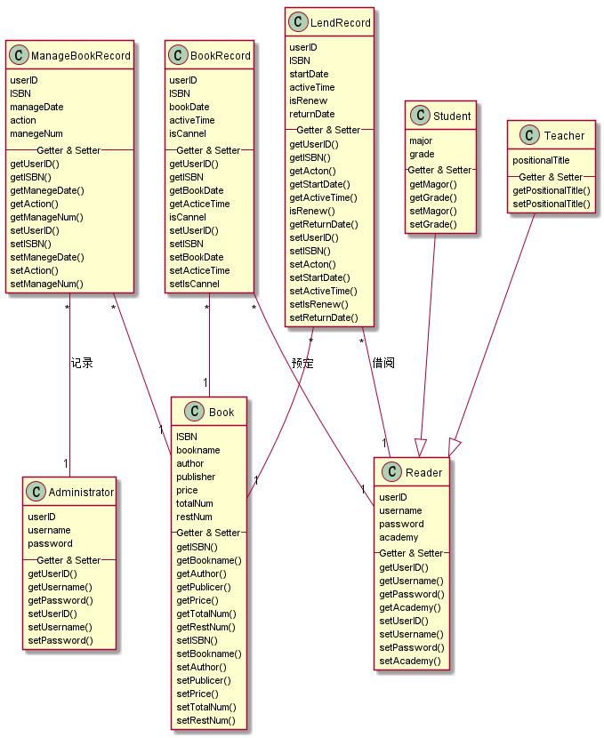

# 实验3：图书管理系统领域对象建模
|学号|班级|姓名|照片|
|:-------:|:-------------: | :----------:|:---:|
|201510414420|软件(本)15-4|吴靖||

## 1. 图书管理系统的类图

### 1.1 类图PlantUML源码如下：

``` class
@startuml

class Administrator{
    userID
    username
    password
    --Getter & Setter--
    getUserID()
    getUsername()
    getPassword()
    setUserID()
    setUsername()
    setPassword()
}

class Book{
    ISBN
    bookname
    author
    publisher
    price
    totalNum
    restNum
    --Getter & Setter--
    getISBN()
    getBookname()
    getAuthor()
    getPublicer()
    getPrice()
    getTotalNum()
    getRestNum()
    setISBN()
    setBookname()
    setAuthor()
    setPublicer()
    setPrice()
    setTotalNum()
    setRestNum()
}

class ManageBookRecord{
    userID
    ISBN
    manageDate
    action
    manegeNum
    --Getter & Setter--
    getUserID()
    getISBN()
    getManegeDate()
    getAction()
    getManageNum()
    setUserID()
    setISBN()
    setManegeDate()
    setAction()
    setManageNum()
}

class Reader{
    userID
    username
    password
    academy
    --Getter & Setter--
    getUserID()
    getUsername()
    getPassword()
    getAcademy()
    setUserID()
    setUsername()
    setPassword()
    setAcademy()
}

class Student{
    major
    grade
    --Getter & Setter--
    getMagor()
    getGrade()
    setMagor()
    setGrade()
}

class Teacher{
    positionalTitle
    --Getter & Setter--
    getPositionalTitle()
    setPositionalTitle()
}

class LendRecord{
    userID
    ISBN
    startDate
    activeTime
    isRenew
    isReturn
    --Getter & Setter--
    getUserID()
    getISBN()
    getActon()
    getStartDate()
    getActiveTime()
    isRenew()
    isReturn()
    setUserID()
    setISBN()
    setActon()
    setStartDate()
    setActiveTime()
    setIsRenew()
    setIsReturn()
}

class BookRecord{
    userID
    ISBN
    bookDate
    activeTime
    isCannel
    --Getter & Setter--
    getUserID()
    getISBN
    getBookDate
    getActiceTime
    isCannel
    setUserID()
    setISBN
    setBookDate
    setActiceTime
    setIsCannel
}

Student --|> Reader
Teacher --|> Reader

ManageBookRecord "*" -- "1" Administrator:登记
ManageBookRecord "*" -- "1" Book

LendRecord "*" -- "1" Reader:借阅
BookRecord "*" -- "1" Reader:预定

LendRecord "*" -- "1" Book
BookRecord "*" -- "1" Book

@enduml
```

### 1.2 类图如下：



### 1.3 类图说明：
本类图中共包含8个类，其中 Administrator 类为管理员类，被借出图书、归还图书、维护图书、用例引用；
Book 类为图书类，由维护图书用例产生，被借出图书、归还图书、维护图书、查询书目、预定图书、借阅图书、图书归还、查询借阅情况用例引用；
ManageBookRecord 类为管理图书日志类，由维护图书用例产生，被维护图书用例引用；
Reader 类为读者类，由维护读者信息用例产生，被维护读者信息、归还图书、借出图书、预定图书、借阅图书、查询借阅情况、取消预定用例引用；
Student类为学生类、Teacher类为教师类他们都继承于Reader类；
LendRecord 类为读者借阅记录类，由借出图书用例产生，被查询借阅情况用例引用；
bookRecord 类读者预定记录类，由预定图书用例产生，被取消预定用例引用。

## 2. 图书管理系统的对象图
### 2.1 类Administrator的对象图
#### 源码如下：
``` object
@startuml
object Administrator{
    userID:"514135"
    username:"石门岩"
    password:"96E79218965EB72C92A549DD5A330112"
    ----
    loadBook()
    removeBook()
    editBookInfo()
    lendBookViaReader()
    returnBookViaReader()
    signinReader()
    signoutReader()
    searchBook()
    findPassword()
    login()
    loginout()
}
@enduml
``` 
#### 对象图如下：


### 2.2 类Book的对象图
#### 源码如下：
``` object
@startuml
object Book{
    ISBN:"9787513506915"
    bookname:"翻译美学理论"
    author:"刘宓庆"
    publisher:"外语教学与研究出版社"
    price:49.90
    totalNum:5
    restNum:3
}
@enduml
``` 
#### 对象图如下：


### 2.3 类ManageBookRecord的对象图
#### 源码如下：
``` object
@startuml
object ManageBookRecord{
    userID:"514135"
    ISBN:"9787310028306"
    manageDate:2018-3-23
    action:"removeBook"
    manegeNum:2
}
@enduml
``` 
#### 对象图如下：


### 2.4类Reader的对象图
#### 源码如下：
``` object
@startuml
object Reader{
    userID:"201510414115"
    username:侯然"
    password:"1A100D2C0DAB19C4430E7D73762B3423"
    academy:"信息科学与工程学院"
    ----
    searchBook()
    bookBook()
    cannelBook()
    showLendRecords()
    findPassword()
    login()
    loginout()
}
@enduml
``` 
#### 对象图如下：


### 2.5 类Student的对象图
#### 源码如下：
``` object
@startuml
object Student{
    major:"软件工程"
    grade:2015
}
@enduml
``` 
#### 对象图如下：


### 2.6 类Teacher的对象图
#### 源码如下：
``` object
@startuml
object Teacher{
    positionalTitle:"教授"
}

@enduml
``` 
#### 对象图如下：


### 2.7 类LendRecord的对象图
#### 源码如下：
``` object
@startuml
object LendRecord{
    userID:"201510414115"
    ISBN:"9787544627634"
    startDate:2018-04-12
    activeTime:30
    isRenew:false
    isReturn:false
}
@enduml
``` 
#### 对象图如下：


### 2.8 类BookRecord的对象图
#### 源码如下：
``` object
@startuml
object BookRecord{
    userID:"201510414115"
    ISBN:"9787513536509"
    bookDate:2018-03-24
    activeTime:7
    isCannel:true
}
@enduml
``` 
#### 对象图如下：

