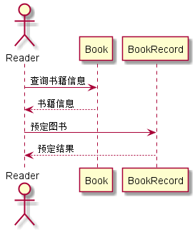
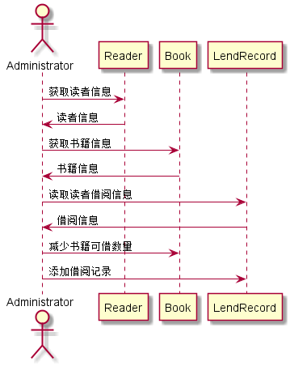
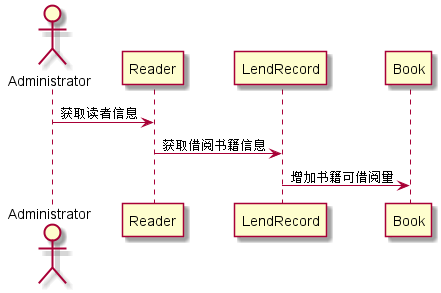
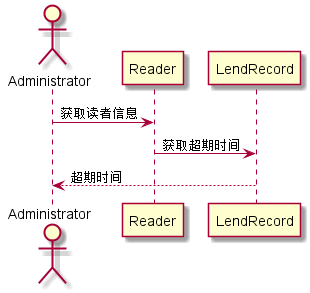
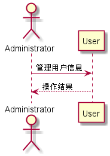
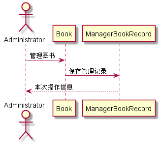

# 实验4：图书管理系统顺序图绘制
|学号|班级|姓名|照片|
|:-------:|:-------------: | :----------:|:---:|
|201510414420|软件(本)15-4|吴靖||

## 图书管理系统的顺序图

## 1. 预定图书用例
## 1.1. 预定图书用例PlantUML源码

``` sequence
@startuml

actor Reader
Reader -> Book:查询书籍信息
Reader <-- Book:书籍信息
Reader -> BookRecord: 预定图书
Reader <-- BookRecord:预定结果

@enduml
```

## 1.2. 预定图书用例顺序图


## 1.3. 预定用例顺序图说明
参与者Reader发起查询图书的请求，对象Reader接收请求并返还图书信息的响应消息，参与者再根据此图书信息向对象BookRecord发起预定图书请求，对象BookRecord接收参与者请求后进行操作最后返回操作状态。

***

## 2. 借书用例
## 2.1. 借书用例PlantUML源码

``` sequence
@startuml

actor Administrator
Administrator -> Reader:获取读者信息
Administrator <- Reader:读者信息

Administrator -> Book:获取书籍信息
Administrator <- Book:书籍信息

Administrator -> LendRecord:读取读者借阅信息
Administrator <- LendRecord:借阅信息

Administrator -> Book:减少书籍可借数量

Administrator -> LendRecord:添加借阅记录

@enduml
```

## 2.2. 借书用例顺序图


## 2.3. 借书用例顺序图说明
参与者Administrator向Reader对象发起获取读者信息的请求，对象Reader接收请求后返回该读者信息；然后参与者Administrator又向对象Book发起获取书籍信息请求，对象Book接收请求后返回该书籍的信息；然后参与者Administrator又向对象LendRecord发起读取读者借阅信息的请求，以获取该读者的借阅信息，参与者Administrator确认无误后向Book发起减少书籍可借数量请求，同时向LendRecord对象发起添加借阅记录的请求。
***

## 3. 还书用例
## 3.1. 还书用例PlantUML源码

``` sequence
@startuml

actor Administrator

Administrator -> Reader:获取读者信息

Reader ->LendRecord:获取借阅书籍信息

LendRecord -> Book:增加书籍可借阅量

@enduml
```

## 3.2. 还书用例顺序图


## 3.3. 还书用例顺序图说明
参与者Administrator向Read对象发起获取读者信息的请求，用户获取读者信息，接着再向LendRecord对象发起获取借阅书籍信息的请求，用于获取用户的借阅信息，并标注黄书时间，最后向Book对象发起增加书籍可借阅量的请求，使得图书数量恢复至结束前的状态。

***

## 4. 缴纳罚金用例
## 4.1. 缴纳罚金用例PlantUML源码

``` sequence
@startuml

actor Administrator

Administrator -> Reader:获取读者信息

Reader ->LendRecord:获取超期时间

LendRecord --> Administrator:超期时间

@enduml
```

## 4.2. 缴纳罚金用例顺序图


## 4.3. 缴纳罚金用例顺序图说明
参与者Administrator向Reader对象发起获取读者信息的请求，接着向LendRecord对象发起获取超期时间的请求，LendRecord对象接收请求后向参与者Administrator返回该用户的超期时间，根据超期时间计算罚金。

***

## 5. 管理用户用例
## 5.1. 管理用户用例PlantUML源码

``` sequence
@startuml

actor Administrator

Administrator -> User:管理用户信息
Administrator <-- User:操作结果

@enduml
```

## 5.2. 管理用户用例顺序图


## 5.3. 管理用户用例顺序图说明
参与者Administrator向Reader对象发起管理用户的请求，Reader对象接收请求后响应操作，最后返回操作结果给参与者Administrator。
***

## 6. 管理图书用例
## 6.1. 管理图书用例PlantUML源码

``` sequence
@startuml

actor Administrator

Administrator -> Book:管理图书
Book -> ManagerBookRecord:保存管理记录
ManagerBookRecord --> Administrator:本次操作信息

@enduml
```

## 6.2. 管理图书用例顺序图


## 6.3. 管理图书用例顺序图说明
参与者Administrator向Book对象发起管理图书的请求，Book对象根据请求进行操作，操作完成后向ManagerBookRecord对象发起保存管理记录的请求，保存操作完成后向参与者Administrator返回操作结果。
***