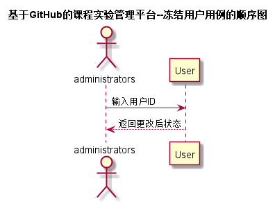

# “冻结用户”用例 [返回](../README.md)
## 1. 用例规约

|用例名称|评定成绩|
|-------|:-------------|
|功能|管理员冻结或解冻学生/老师的账户|
|参与者|管理员|
|前置条件| 管理员需先登录系统|
|后置条件| |
|主事件流| 1. 查找要冻结或解冻的账户   2. 设置账户冻结状态为相反值    |
|备选事件流| |

## 2. 业务流程（顺序图） [源码](../src/sequence冻结用户.puml)
 

    
## 3. 界面设计
- 界面参照: https://ikowalski.github.io/is_analysis/test6/ui/查询用户.html

- API接口调用

    - 接口1：[setUserDisable](../接口/setUserDisable.md)
    
    
## 4. 算法描述
    无
    
## 5. 参照表

- [User](../数据库设计.md/#User)