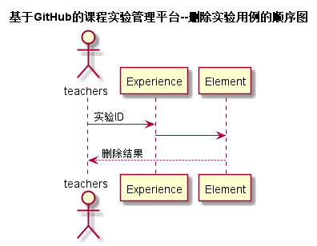

# “删除实验”用例 [返回](../README.md)

## 1. 用例规约

|用例名称|登出|
|-------|:-------------|
|功能|删除已创建实验|
|参与者|老师|
|前置条件|实验已创建|
|后置条件||
|主事件流| 1. 提交要删除的实验 2 . 删除实验 3 . 删除该实验对应的评分项|
|备选事件流|1a. 实验中存在已录入成绩的评分项  &nbsp;&nbsp; 1.提示该实验已录入部分成绩 &nbsp;&nbsp; 2.继续或取消删除实验|

## 2. 业务流程（顺序图） [源码](../src/sequence删除实验.puml)
 

## 3. 界面设计
- 界面参照: https://ikowalski.github.io/is_analysis/test6/ui/查询实验.html
- API接口调用
    - 接口1：[deleteExperience](../接口/deleteExperience.md)

## 4. 算法描述
    无
    
## 5. 参照表

- [Course](../数据库设计.md/#Course)

