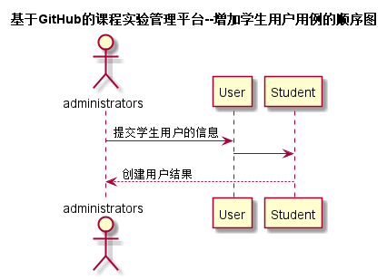

# “增加学生用户”用例 [返回](../README.md)
## 1. 用例规约

|用例名称|评定成绩|
|-------|:-------------|
|功能|管理员增加一个学生用户|
|参与者|管理员|
|前置条件| 管理员已登录账户|
|后置条件| |
|主事件流| 1. 选择添加用户的类型为学生   2. 填写用户的详细信息    3. 提交    |
|备选事件流| |

## 2. 业务流程（顺序图） [源码](../src/sequence增加学生用户.puml)
 

    
## 3. 界面设计
- 界面参照: https://ikowalski.github.io/is_analysis/test6/ui/增加用户.html

- API接口调用

    - 接口1：[addNewUser](../接口/addNewUser.md)
    
## 4. 算法描述
    无
    
## 5. 参照表

- [STUDENTS](../数据库设计.md/#STUDENTS)
- [GRADES](../数据库设计.md/#GRADES)
- [TESTS](../数据库设计.md/#TESTS)