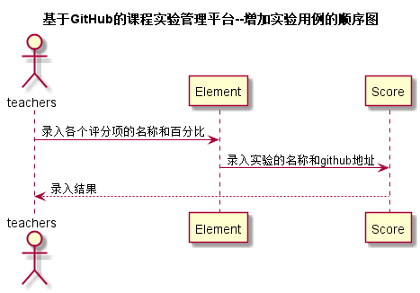

# “增加实验”用例 [返回](../README.md)
## 1. 用例规约

|用例名称|评定成绩|
|-------|:-------------|
|功能|老师增加一个实验的信息|
|参与者|老师|
|前置条件|老师已选择一门课程，已登录账户|
|后置条件| |
|主事件流| 1. 填写实验名称、实验github地址   2. 添加实验的评分项及其分数占比    3. 提交    |
|备选事件流|2a. 评分项分数占比总量不是100  &nbsp;&nbsp; 1.提示用户重新输入评分项的分数占比|

## 2. 业务流程（顺序图） [源码](../src/sequence增加实验.puml)
 

    
## 3. 界面设计
- 界面参照: https://ikowalski.github.io/is_analysis/test6/ui/设置实验信息.html

- API接口调用
    - 接口1：[setExperienceAllpart](../接口/setExperienceAllpart.md)
    
## 4. 算法描述
    无
    
## 5. 参照表

- [Element](../数据库设计.md/#STUDENTS)
- [Score](../数据库设计.md/#GRADES)