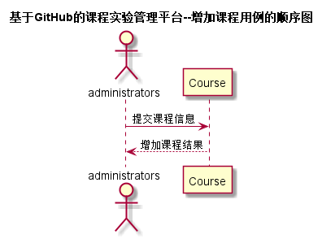

# “增加课程”用例 [返回](../README.md)
## 1. 用例规约

|用例名称|评定成绩|
|-------|:-------------|
|功能|管理员增加新课程|
|参与者|管理员|
|前置条件| 管理员需要登录|
|后置条件| |
|主事件流| 1. 填写课程的详细信息    2. 提交    |
|备选事件流| |

## 2. 业务流程（顺序图） [源码](../src/sequence增加课程.puml)
 

    
## 3. 界面设计
- 界面参照: https://ikowalski.github.io/is_analysis/test6/ui/增加课程.html

- API接口调用

    - 接口1：[addNewCourse](../接口/addNewCourse.md)
        
    
## 4. 算法描述
    无
    
## 5. 参照表

- [Course](../数据库设计.md/#Course)