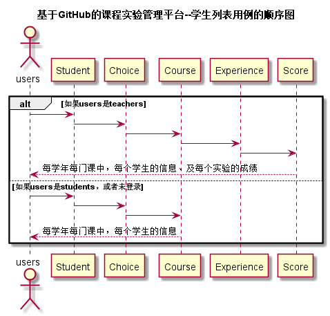

<!-- markdownlint-disable MD033-->
<!-- 禁止MD033类型的警告 https://www.npmjs.com/package/markdownlint -->

# “学生列表”用例 [返回](../README.md)
## 1. 用例规约

|用例名称|学生列表|
|-------|:-------------|
|功能|以表形式的显示出所有学生的信息|
|参与者|游客，学生，老师|
|前置条件|学生，老师需要先登录|
|后置条件| |
|主事件流| |
|备选事件流| |

## 2. 业务流程（顺序图） [源码](../src/sequence学生列表.puml)
 

## 3. 界面设计
- 界面参照: https://ikowalski.github.io/is_analysis/test6/ui/index.html
- API接口调用
    - 接口1：[getStudents](../接口/getStudents.md) 

## 4. 算法描述

- score_list解析为列表  
  - score_list是接口getStudents的返回值中的一部分，形如："score_list":"76,-1,-1,-1,-1"。需要在前端进行解析。  
  - 学生在某门课程里的实验成绩汇总（来自Score表），以逗号隔开，第N个是第N个实验的成绩，-1表示未批阅
  - 比如：“76,-1,-1,-1,-1”表示第1个实验成绩为76分，其他的实验未批阅。  
  - 算法是使用使用字符串分离方法将其分开。

- exper_ID_list解析为列表
    - exper_ID_list是接口getStudents的返回值中的一部分，形如："exper_ID_list":"43525653,54725762,97536256,98146754,13478635"。需要在前端进行解析。
    - 该门课程的实验ID汇总（来自Experience表），以逗号分开，第N个是第N个实验的实验ID。    
    - 比如："43525653,54725762,97536256,98146754,13478635"中，第一个表示第一个实验的实验ID，第二个表示第二个实验的实验ID。
    - 这里的实验ID与课程ID和学生ID协作用于“评定成绩”中动态生成超链接，准确定位评定成绩页面内容。
    - 算法是使用使用字符串分离方法将其分开。
    
## 5. 参照表

- [Student](../数据库设计.md/#Student)
- [Choice](../数据库设计.md/#Choice)
- [Course](../数据库设计.md/#Course)
- [Experience](../数据库设计.md/#Experience)
- [Score](../数据库设计.md/#Score)