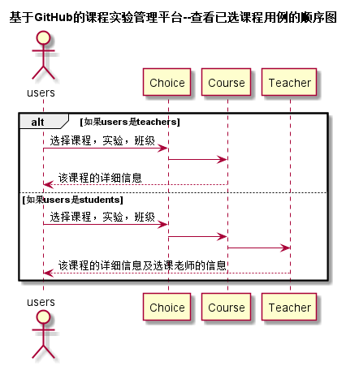

# “查看已选课程”用例 [返回](../README.md)
## 1. 用例规约

|用例名称|查看成绩|
|-------|:-------------|
|功能|学生/老师查看已选课程|
|参与者|学生/老师|
|前置条件|用户需要先登录，并已完成课程选择|
|后置条件| |
|主事件流| 1.用户根据需要选择要查看课程的学期|
|备选事件流| |

## 2. 业务流程（顺序图） [源码](../src/sequence查看已选课程.puml)
 

## 3. 界面设计
- 界面参照: https://ikowalski.github.io/is_analysis/test6/ui/查看已选课程.html
- API接口调用
    - 接口1：[getCourseChosen](../接口/getCourseChosen.md) 

## 4. 算法描述
    无
    
## 5. 参照表
- [Choice](../数据库设计.md/#Choice)
- [Course](../数据库设计.md/#Course)
- [Teacher](../数据库设计.md/#Teacher)