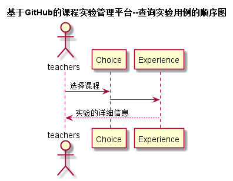

# “查询实验”用例 [返回](../README.md)
## 1. 用例规约

|用例名称|查询实验|
|-------|:-------------|
|功能|老师查询实验|
|参与者|老师|
|前置条件|老师需要先登录|
|后置条件| |
|主事件流| 1.老师选择需要查找实验的课程|
|备选事件流| |

## 2. 业务流程（顺序图） [源码](../src/sequence查询实验.puml)
 

## 3. 界面设计
- 界面参照: https://ikowalski.github.io/is_analysis/test6/ui/查询实验.html
- API接口调用
    - 接口1：[getExperienceAllPart](../接口/getExperienceAllPart.md) 

## 4. 算法描述
    无
    
## 5. 参照表
- [Choice](../数据库设计.md/#Choice)
- [Experience](../数据库设计.md/#Experience)