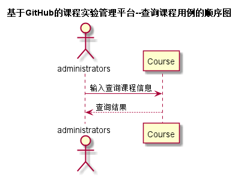

# “查询课程”用例 [返回](../README.md)
## 1. 用例规约

|用例名称|查询实验|
|-------|:-------------|
|功能|管理员查询课程|
|参与者|管理员|
|前置条件|管理员需要先登录|
|后置条件| 显示查询课程的结果|
|主事件流| 1.输入要查询的内容  2. 提交查询请求 |
|备选事件流| |

## 2. 业务流程（顺序图） [源码](../src/sequence查询课程.puml)
 

## 3. 界面设计
- 界面参照: https://ikowalski.github.io/is_analysis/test6/ui/查询课程.html
- API接口调用
    - 接口1：[getCourse](../接口/getCourse.md) 

## 4. 算法描述
    无
    
## 5. 参照表
- [Course](../数据库设计.md/#Course)