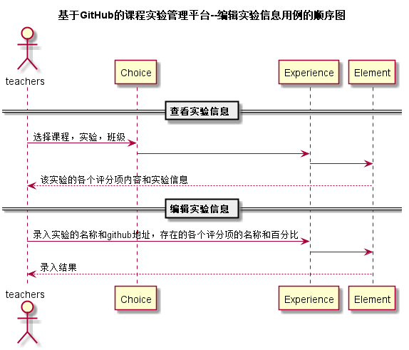

# “编辑实验信息”用例 [返回](../README.md)
## 1. 用例规约

|用例名称|评定成绩|
|-------|:-------------|
|功能|老师编辑一个实验的信息|
|参与者|老师|
|前置条件|老师已选择一门课程，该实验未开始评定成绩|
|后置条件| |
|主事件流| 1. 查看该实验的详细信息  2. 填写实验名称、实验github地址   3. 添加实验的评分项及其分数占比或删除此项评分项    4. 提交    |
|备选事件流|3a. 评分项分数占比总量不是100  &nbsp;&nbsp; 1.提示用户重新输入评分项的分数占比|

## 2. 业务流程（顺序图） [源码](../src/sequence编辑实验信息.puml)
 

    
## 3. 界面设计
- 界面参照: https://ikowalski.github.io/is_analysis/test6/ui/设置实验信息.html

- API接口调用

    - 接口1：[getExperienceAllPart](../接口/getExperienceAllPart.md)
        
        获取该实验的实验信息
        
    - 接口2：[setExperienceAllpart](../接口/setExperienceAllpart.md)
        
        更改实验的信息
    
## 4. 算法描述
- element_ID解析为字符串
    - element_ID是接口setExperienceAllPart的请求实例中的一部分，形如："element_ID":"6352638"。
    - 此为评分项的ID，在编辑完成后若不提交已存在的评分项ID，则视为删除这部分评分项。
    
## 5. 参照表

- [Choice](../数据库设计.md/#Choice)
- [Experience](../数据库设计.md/#Experience)
- [Element](../数据库设计.md/#Element)